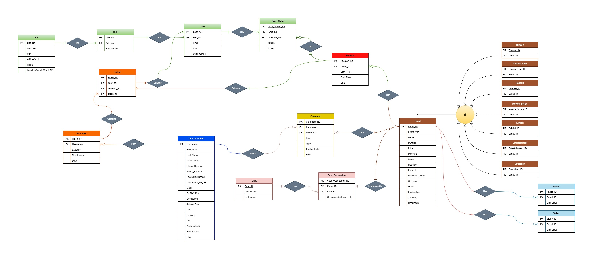
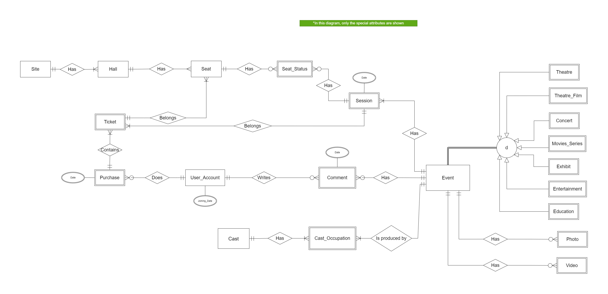

# **<a href="https://www.tiwall.com/">Tiwall</a>'s Database**

This project implements the database structure for **Tiwall**, a web-based ticket shop for theatre, cinema, and other cultural events. The project includes entity definitions, an entity-relationship (ER) model, SQL queries for various data retrieval tasks, and a final database script for setting up the system.

## **Project Structure**
- **DB_Entities.xlsx**  
  A structured list of database entities and attributes, detailing the core components of the database schema.

- **Entities/**  
  - *Tiwall Project Report.pdf*: A report documenting the database design, schema explanation, and project insights.

- **ER/**  
  - *ER.drawio.xml & ER.jpg*: The primary entity-relationship diagram representing the database structure. 
  

     
  

  - *ER_solid.drawio.xml & ER_solid.jpg*: A refined version of the ER diagram with solidified relationships and constraints. 
  

    
  

- **queries/**  
  A collection of SQL queries designed to interact with and extract insights from the database. These include:  
  - Retrieving all comments for a specific event.  
  - Finding events by an artist's name.  
  - Listing theatres with available seats or discounts.  
  - Extracting user information based on location and registration date.  
  - Aggregating sales, ticket purchases, and event attendance.  

- **Tiwall.sql**  
  The main SQL script for creating the database schema, including tables, constraints, and initial data.

## **Key Features**
- **Comprehensive ER Model**: Captures entities like users, events, theatres, tickets, and comments with well-defined relationships.
- **Efficient Queries**: Optimized SQL queries for retrieving ticket sales, user engagement, and event popularity.
- **Scalable Design**: Ensures flexibility for future expansions, such as additional event categories or payment integrations.
